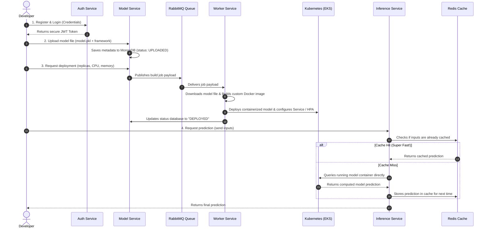

# 🚀 AI-DEPLOY: The Complete Project Guide

Welcome to the **AI-DEPLOY** platform documentation! This single, comprehensive guide explains exactly how the system is structured, what each component does in plain English, and how to run and test the entire project from scratch.

---

## 📖 1. What is AI-DEPLOY? (The Simple Explanation)

In the real world, training a Machine Learning model (like Scikit-Learn or PyTorch) is only half the battle. To actually use it, you need to turn that model into a web API so other apps can send data and get predictions back.

**AI-DEPLOY is an automated MLOps platform.** It does this work for you:
1. **Upload:** You upload a raw model file (e.g. `model.pkl`).
2. **Build:** The platform automatically builds a custom, secure Docker container around your model.
3. **Deploy:** It launches that container on a Kubernetes cluster with autoscaling enabled.
4. **Serve:** It routes incoming user requests to your model, caching frequent queries in Redis for lightning-fast latency (~1ms).

---

## 📂 2. Project File Structure (Visual Map)

Here is a visual directory tree showing where everything lives and what it represents:

```text
AI-DEPLOY/
│
├── .github/workflows/          # 🤖 GitHub Actions CI/CD Automated Pipelines
│   ├── ci.yml                  # Runs unit tests & security checks on code push
│   └── deploy.yml              # Automatically builds and deploys services to AWS
│
├── docs/                       # 📄 Project Guides & Technical Documentation
│   ├── architecture.md         # Deep-dive system design reference
│   ├── running-guide.md        # Step-by-step testing scripts
│   └── post-migration-setup.md # Guide for configuring secret credentials
│
├── infrastructure/terraform/   # ☁️ Cloud Infrastructure Setup (Infrastructure as Code)
│   ├── documentdb.tf           # Provisions Amazon DocumentDB (MongoDB) in AWS
│   ├── eks.tf                  # Provisions AWS Kubernetes cluster
│   ├── main.tf                 # Global Terraform settings and providers
│   └── outputs.tf              # Cloud outputs (connection endpoints)
│
├── k8s/base/                   # ☸️ Kubernetes Deployment Manifests
│   ├── secrets.yaml            # Base64 encoded environment variables (MONGO_URI, JWT keys)
│   ├── auth-service.yaml       # Deployment & Service settings for Auth Service
│   ├── model-service.yaml      # Deployment & Service settings for Model Service
│   ├── inference-service.yaml  # Deployment & Service settings for Inference Service
│   └── worker-service.yaml     # Deployment & Service settings for Worker Service
│
├── monitoring/                 # 📈 Observability & Dashboards
│   ├── prometheus/             # Prometheus metric-scraping configurations
│   └── grafana/                # Grafana dashboards for visual statistics
│
├── scripts/                    # 🛠️ Database Setup Scripts
│   └── init_db.js              # Initializes MongoDB collections, schemas, and indexes
│
├── services/                   # 🐍 The Core Microservices (Python / FastAPI)
│   │
│   ├── auth-service/           # 🔐 Handles JWT User Accounts & Sign-In
│   │
│   ├── model-service/          # 🗂️ Manages Model upload records & triggers deployments
│   │
│   ├── inference-service/      # ⚡ High-throughput gateway that routes predictions & caches in Redis
│   │
│   └── worker-service/         # 🔨 Background task engine (Builds Docker images & deploys to Kubernetes)
│       └── app/templates/      # Framework templates (Flask/FastAPI wrapper servers) for:
│           ├── tensorflow/
│           ├── pytorch/
│           ├── sklearn/
│           └── xgboost/
│
├── docker-compose.yml          # 🐳 Local Infrastructure orchestration (MongoDB, Redis, RabbitMQ)
├── .env.example                # 🗝️ Template for local security keys
└── README.md                   # 🏁 Root project introduction
```

---

## ⚙️ 3. Core Components (Plain English Explanations)

Our system is split into four primary microservices, alongside three infrastructure containers:

### The Microservices (FastAPI)
| Service Name | What it does | Simple Analogy |
|---|---|---|
| **Auth Service (`port 8001`)** | Registers users, handles logins, and issues secure JWT tokens. Uses Redis to blacklist logged-out tokens. | **The Bouncer:** Decides who is allowed to enter and edit the system. |
| **Model Service (`port 8002`)** | Receives model file uploads, saves their metadata to MongoDB, and publishes deployment jobs to RabbitMQ. | **The Store Manager:** Accepts your inventory and puts a ticket in the queue. |
| **Inference Service (`port 8003`)** | Accepts prediction inputs from users, checks if the answer is already cached in Redis. If not, forwards the request directly to the model container in Kubernetes. | **The Fast-Food Cashier:** Takes your order, checks if it's already pre-made (cached), or gets it cooked. |
| **Worker Service (`no port`)** | Runs constantly in the background. It reads tasks from RabbitMQ, downloads model files, builds a Docker image using our framework templates, pushes it to ECR, and deploys it to Kubernetes. | **The Builder:** The hard worker in the back doing the heavy lifting, containerizing, and deploying. |

### The Infrastructure
* **MongoDB (`port 27017`):** The primary database. It stores user accounts, model records, and deployment histories as flexible, document-like JSON blocks.
* **Redis (`port 6379`):** A super-fast in-memory cache database. It stores prediction outputs and user-session token blacklists so we don't have to recalculate or query heavy databases over and over.
* **RabbitMQ (`port 5672`):** A message queue system. It lets microservices speak to each other asynchronously. The Model Service drops a "Deploy Model X" message, and the Worker Service pulls it whenever it is ready to work.

---

## 🔄 4. How a Model is Deployed (The Journey)

Below is the step-by-step lifecycle of how a model travels through the platform:



---

## ⚡ 5. How to Run the Project Locally

Follow these quick instructions to get the entire ecosystem running on your machine:

### 1. Pre-requisites
* Install **Docker Desktop** on your machine and make sure it is running.

### 2. Configure Environment variables
Copy the `.env.example` template into a new `.env` file in the project root:
* *On Windows PowerShell:* `copy .env.example .env`
* *On macOS/Linux:* `cp .env.example .env`

### 3. Start the containers
Launch all database containers and microservices in the background:
```bash
docker compose up --build -d
```
*(Wait 1-2 minutes for all systems to boot up and report healthy).*

### 4. Seed the Database
Initialize your MongoDB database with pre-configured validation rules and query indexes:
```bash
docker exec -i ai-deploy-mongodb mongosh aideploy /docker-entrypoint-initdb.d/init_db.js
```

---

## 🧪 6. Testing the Platform (Simple Curl commands)

Once the project is running, open a terminal window and run these simple commands to verify that everything works:

### 1. Register a Developer Account
```bash
curl -X POST http://localhost:8001/auth/register \
  -H "Content-Type: application/json" \
  -d '{"email": "developer@ai-deploy.io", "password": "SecurePassword123", "role": "developer"}'
```

### 2. Log In to Receive your JWT Token
```bash
curl -X POST http://localhost:8001/auth/login \
  -H "Content-Type: application/x-www-form-urlencoded" \
  -d "username=developer@ai-deploy.io&password=SecurePassword123"
```
*(Copy the long `access_token` string in the response. Replace `<JWT_TOKEN>` in the commands below with this code).*

### 3. Upload a Model
Create a mock model file and upload it to the platform:
```bash
# Create a dummy model file
echo "mock_scikit_learn_binary_data" > test_model.pkl

# Upload to Model Service (port 8002)
curl -X POST http://localhost:8002/models/upload \
  -H "Authorization: Bearer <JWT_TOKEN>" \
  -F "name=churn-prediction-model" \
  -F "framework=sklearn" \
  -F "version=1.0.0" \
  -F "file=@test_model.pkl"
```
*(Copy the `"id"` field from the response. Replace `<MODEL_ID>` in the command below with this ID).*

### 4. Deploy the Model
Trigger the build and deployment process:
```bash
curl -X POST http://localhost:8002/models/<MODEL_ID>/deploy \
  -H "Authorization: Bearer <JWT_TOKEN>" \
  -H "Content-Type: application/json" \
  -d '{"replicas": 1, "cpu_request": "100m", "memory_request": "128Mi", "enable_autoscaling": false}'
```

### 5. Check Observability Dashboards
Open your web browser and view performance metrics live:
* **Prometheus UI:** `http://localhost:9090` (Verify targets are active and scraped).
* **Grafana Dashboards:** `http://localhost:3000` (Log in with `admin` / `admin` to view live dashboards).
